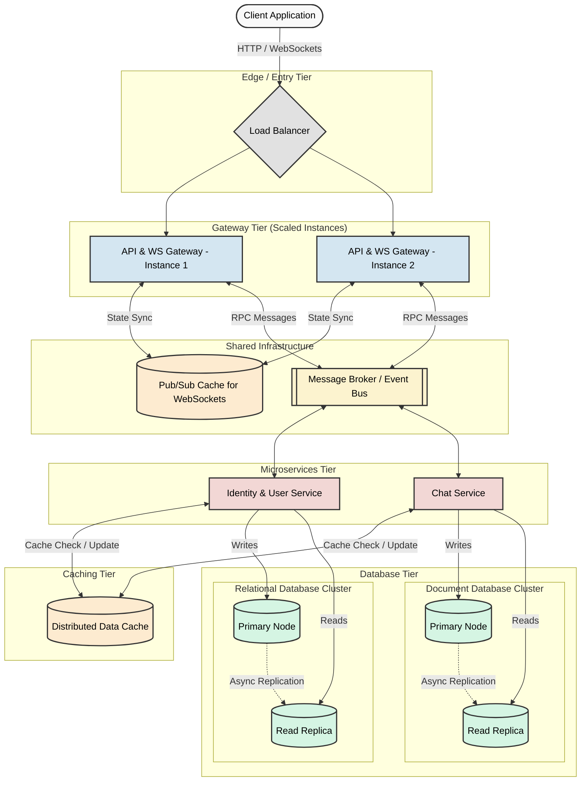

# Turborepo Monorepo Template: Next.js & NestJS

This template provides a robust monorepo foundation featuring a **[Next.js](https://nextjs.org/)** frontend, a **[NestJS](https://nestjs.com/)** backend, and a shared **[shadcn/ui](https://ui.shadcn.com/)** component library. It utilizes **[Turborepo](https://turborepo.dev/)** for fast, incremental build pipelines.

- [Turborepo Monorepo Template: Next.js \& NestJS](#turborepo-monorepo-template-nextjs--nestjs)
  - [A Few Notes Before Diving In](#a-few-notes-before-diving-in)
  - [Creating a Monorepo with shadcn/ui Built-In](#creating-a-monorepo-with-shadcnui-built-in)
  - [🚀 Adding a NestJS App to the Monorepo](#-adding-a-nestjs-app-to-the-monorepo)
    - [Step 1: Scaffold the NestJS App](#step-1-scaffold-the-nestjs-app)
    - [Step 2: Configure Shared Packages](#step-2-configure-shared-packages)
  - [Configuring Prettier and Eslint](#configuring-prettier-and-eslint)
  - [🧪 Configuring Jest Testing](#-configuring-jest-testing)
    - [🚨 The Problem It Solves](#-the-problem-it-solves)
    - [📁 File Breakdown](#-file-breakdown)
  - [Shared types package](#shared-types-package)
  - [🧩 UI Components (shadcn/ui)](#-ui-components-shadcnui)
    - [Tailwind Configuration](#tailwind-configuration)
    - [Adding New Components](#adding-new-components)
    - [Using Components in your Apps](#using-components-in-your-apps)

---

## A Few Notes Before Diving In

This README focuses on how to set up a Turborepo workspace with NestJS and how to configure shared utilities. If you are only interested in using this project template as-is, you can skip this section and just run these commands:

```bash
pnpm build --filter @workspace/jest-config
pnpm build --filter @workspace/types
```

**Note:** For the best development experience for the types package, you will need to build it every time you add new enum.

This project uses **[pnpm](https://pnpm.io/)** as its package manager. Turborepo highly recommends using pnpm in monorepos to optimize disk space and dependency resolution. Please follow the [installation guide](https://pnpm.io/installation) before proceeding.

Additionally, it is recommended to install the NestJS CLI globally on your machine to streamline your workflow:

```bash
npm install -g @nestjs/cli
```

---

## Creating a Monorepo with shadcn/ui Built-In

The base of this project was generated using the shadcn/ui CLI. You can find more details on their official [monorepo setup](https://ui.shadcn.com/docs/monorepo).

```bash
pnpm dlx shadcn@latest init --monorepo
```

---

## 🚀 Adding a NestJS App to the Monorepo

Follow these steps to generate and configure a new NestJS application within the workspace.

### Step 1: Scaffold the NestJS App

Run the NestJS CLI command from your `apps` directory:

```bash
nest new api --skip-git --package-manager pnpm
```

This command creates a NestJS repository inside the `apps` directory without initializing a new `.git` file, as Turborepo manages version control at the workspace root.

### Step 2: Configure Shared Packages

Follow these steps to link your new API to the monorepo's shared configuration standards (based on the [Turborepo examples repository](https://github.com/vercel/turborepo/tree/main/examples/with-nestjs)):

1. **TypeScript Config:** Add `nestjs.json` to the `@workspace/typescript-config` package. Extend it from the base config by copying the rules from your current `tsconfig.json`.
2. **ESLint Config:** Add a `nest.js` configuration file to the `@workspace/eslint-config` package and migrate the rules from the default NestJS setup.
3. **App Dependencies:** In `apps/api/package.json`, add imports for both `@workspace/typescript-config` and `@workspace/eslint-config` as `devDependencies`.
4. **Extend Configs:** Update your `apps/api/tsconfig.json` and `eslint.config.mjs` to extend these newly shared configurations.
5. **Troubleshooting:** If TypeScript throws an error stating it cannot find the new files (even with correct paths), open either `tsconfig.json` or `tsconfig.build.json` in your app and explicitly add the file name to the `include` array.

## Configuring Prettier and Eslint

To ensure consistent code formatting across all applications and packages:

1. **Update Shared Config:** Add a `prettier-base.js` file to the `@workspace/eslint-config` package that exports a standard Prettier configuration object.
2. **Root Config:** Add a `.prettierrc.mjs` file to the root workspace directory and set it to import and use the shared config.
3. **App Config:** Update `apps/api/.prettierrc.mjs` and `apps/web/.prettierrc.mjs` to point to the shared configuration.
4. **Troubleshooting:** Ensure you add `.prettierrc.mjs` to the `include` property of your app's `tsconfig.json` to prevent module resolution errors.
5. **Update root eslint config file:** You will want to update your .eslintrc.js to new ES format, since the one generate by shadcn/ui or turborepo uses the older format which will be ignore by eslint. Alternatively, you can update your root tsconfig to change this file to ES newer format.

---

## 🧪 Configuring Jest Testing

This monorepo uses a centralized testing configuration strategy to keep frontend and backend test environments isolated but easy to maintain.

**Setup Steps:**

1. Create a `package.json` in `packages/jest-config` with `typescript`, `next`, and `jest` as `devDependencies`. This file dictates how your Jest rules are exported to the rest of the workspace.
2. Create a tsconfig that extend and overwrite some rule of base.json.

```typescript
{
  "extends": "@workspace/typescript-config/base.json",
  "compilerOptions": {
    "declaration": true,
    "declarationMap": true,
    "allowJs": true,
    "esModuleInterop": true,
    "incremental": false,
    "module": "commonjs",
    "moduleResolution": "Node10",
    "outDir": "dist",
    "baseUrl": "src",
    "strictNullChecks": true
  },
  "include": ["src"],
  "exclude": ["node_modules", "test", "dist", "**/*spec.ts"]
}
```

3. Create a `src/base.ts` file. This turns on code coverage, configures the V8 engine for faster tracking, and sets the default test environment to `jsdom`.
4. Create a `src/nest.ts` file. This overrides the base config to use a `node` environment (since APIs do not run in browsers), targets `.spec.ts` files, and wires up `ts-jest`.
5. Create a `src/next.ts` file. This extends `base.ts` by wrapping it in `next/jest`, appending React-specific file extensions (`jsx`, `tsx`), and injecting the setup file via `setupFilesAfterEnv: ['<rootDir>/jest.setup.ts']`.
6. Run the following command from the root to install DOM testing utilities for the frontend:

   ```bash
   pnpm add -D jest jest-environment-jsdom @testing-library/react @testing-library/dom @testing-library/jest-dom @types/jest --filter web
   ```

7. In your `web` app, create a `jest.setup.ts` file and a `__tests__` folder. Import `@testing-library/jest-dom` inside `jest.setup.ts` so it is globally available to all tests.
8. Update your frontend `tsconfig.json` to include `"types": ["jest"]`, and add `jest.setup.ts` and the `__tests__` folder to the `include` array. _(Note: As mentioned in the Next.js docs, be mindful of naming collisions with the `Config` type)._

- You also want to add these script to your web package.json `"test": "jest", "test:watch": "jest --watch"`

8. Use `src/entry.ts` to export all the configurations you just created.
9. Build the shared package so the types and distributions become available across the workspace:

```bash
pnpm build --filter @workspace/jest-config
```

10. Update your app `package.json` files to include `@workspace/jest-config` as a dependency, and create a local `jest.config.ts` in each app that imports the respective shared config.
11. Finally go to turbo.json and add these line inside your task

```json
  "test": {},
  "test:watch": {
    "cache": false,
    "persistent": true
  }
```

### 🚨 The Problem It Solves

- **Next.js** requires tests to run in a simulated browser (`jsdom`) and needs the SWC compiler for React components.
- **NestJS** requires tests to run in a pure Node environment (`node`) and relies heavily on `ts-jest` for TypeScript decorators.
- **Solution:** This centralized setup enforces DRY (Don't Repeat Yourself) principles, guarantees strict typing via `satisfies Config`, and ensures complete framework isolation.

### 📁 File Breakdown

- **`base.ts` (The Foundation):** Defines the generic rules. Turns on code coverage, sets the V8 coverage provider, and establishes `jsdom` as the default environment.
- **`nest.ts` (The Backend Config):** Overwrites the base to use a `node` environment and wires up `ts-jest` to compile NestJS decorators properly.
- **`next.ts` (The Frontend Config):** Wraps the base config in `next/jest`, allowing Next.js to automatically handle path aliases, SWC compilation, and `.env` loading before tests run.

---

## Shared types package

Quite similar to jest package except easier

1. Create type package with typescript as dev dependency and add these two lines

```json
"main": "./dist/index.js",
"types": "./dist/index.d.ts",
```

2. Create a similar tsconfig file as jest's package.
3. Build types package. **Note:** You can also add `tsc -w` to run as dev server without having to rebuild the package every time you change something

```bash
pnpm build --filter @workspace/types
```

1. We will need to add the path to types package so that nestjs can find it and compile it to javascript.

```json
"@workspace/types": ["../../packages/types"],
```

5. For nextjs, we will simply add `'@workspace/types'
` to transpilePackages array.

---

## 🧩 UI Components (shadcn/ui)

This template is pre-configured with a shared UI package powered by Tailwind CSS and shadcn/ui.

### Tailwind Configuration

Your `tailwind.config.ts` and `globals.css` are already set up to scan and use components directly from the `@workspace/ui` package.

### Adding New Components

To add a new component (e.g., a Button) to your repository, run the following command from the root of your `web` app:

```bash
pnpm dlx shadcn@latest add button -c apps/web
```

_Note:_ This will place the UI components securely into the `packages/ui/src/components` directory so they can be shared across multiple applications.

### Using Components in your Apps

Simply import them from the shared UI workspace package:

```tsx
import { Button } from '@workspace/ui/components/button';

export default function MyPage() {
  return <Button>Click Me</Button>;
}
```



**Note**: If you can't connect to RabbitMQ or get No_Authorized in rabbitmq management. Run following command

```shell
docker-compose rm -s -v rabbitmq
docker-compose up -d
```
